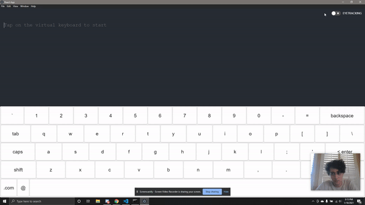

# Eyetracking Client



## Getting Started

This app provides a virtual keyboard that enables the user to type using a connected eyetracking device.

### Installation
```npm install```

```npm install -g foreman```

### Running the app
```npm run start```

### About

This app leverages the [eyetracking](https://github.com/EyeTrackingCSE/eyetracking) to bind Tobii `GazeFocusEvent`s to a virtual keyboard, enabling the user to type using their eyes.

The app is built using [React.js](https://reactjs.org/) in conjunction with [Electron.js](https://www.electronjs.org/).